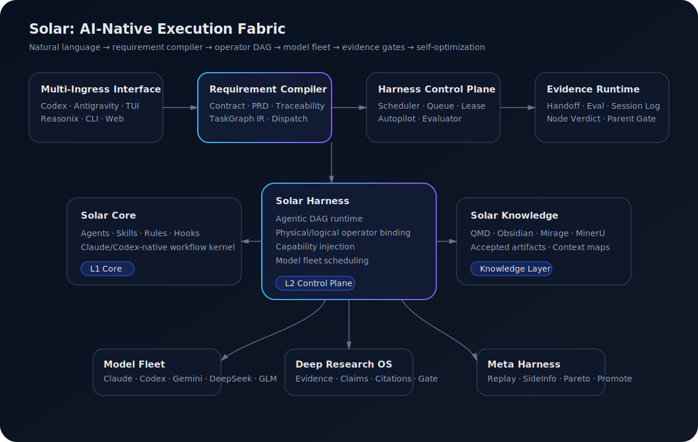
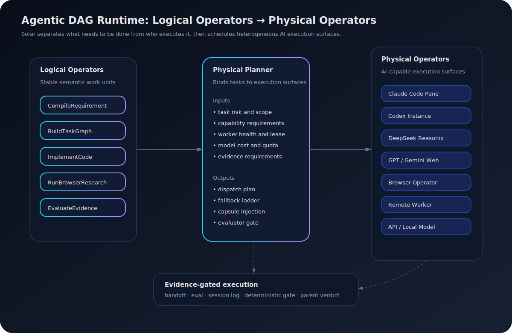

# Solar

> **Autonomous Software Organization Runtime**  
> 让用户当老板，让 AI 组织自己完成软件工程。

[](LICENSE)
[](CLAUDE.md)
[](harness/)
[](#solar-是什么)

Solar is an AI-native execution fabric for long-running, evidence-driven software work. It is not a chatbot, not a prompt collection, and not a simple multi-agent demo. Solar treats natural language as the control surface, requirements as compilable artifacts, AI products as schedulable physical operators, and software delivery as evidence-gated DAG execution.

中文一句话：**Solar 把老板的一句话编译成一支 AI 组织的自主行动。**

---

## Solar 是什么

Solar 当前由三层组成：

| Layer | Directory | Role |
|---|---|---|
| **Solar Core** | `CLAUDE.md`, `agents/`, `skills/`, `rules/`, `hooks/`, `core/` | Claude/Codex-native workflow kernel: agents, skills, rules, hooks, and operating context. |
| **Solar Harness** | `harness/` | Requirement compiler, sprint control plane, TaskGraph runtime, actor/operator fleet, evaluator, benchmark, and experience memory. |
| **Solar Knowledge** | `docs/`, `scripts/`, research adapters, runtime-generated indices | Knowledge surface for docs, accepted artifacts, research evidence, source maps, and future context maps. |

Solar 的核心价值观：

- **Human as Boss, not Runtime Glue** — 用户只表达目标、边界、预算和偏好。
- **AI manages AI** — Solar 负责需求澄清、任务分解、调度、打回、验收和汇报。
- **AI develops AI** — Solar 可以构建 skills、capsules、MCP、evaluators、reports 和代码产物。
- **AI optimizes AI** — Solar 通过 evidence、side-info、benchmarks、scorecards 和 Meta Harness 优化自己的策略。
- **Evidence defines completion** — 没有 handoff、eval、test、artifact 或 deterministic gate，就不能宣称完成。

---

## Why Solar is different

Most agent frameworks start with a model loop. Solar starts with an operating model.

```text
普通 Agent:       prompt -> plan -> tool calls -> answer
Solar Harness:   intent -> contract -> PRD/plan -> TaskGraph IR -> operator binding
                 -> lease -> dispatch -> handoff -> eval -> gate -> memory -> optimization
```

| Design axis | Conventional agent loop | Solar |
|---|---|---|
| User role | operator who keeps prompting | boss who sets goals and boundaries |
| Task unit | prompt or todo | file-backed contract + TaskGraph IR |
| Execution unit | model/API call | AI-capable physical operator |
| Scheduling | ad hoc tool choice | logical operator → actor/host binding |
| Parallelism | multiple chats or workers | DAG, write scope, leases, runtime state |
| Quality | model self-report or user inspection | handoff, eval, deterministic gates, parent gate |
| Memory | chat history or RAG | session log, projection, accepted artifacts, context maps |
| Optimization | manual prompt tuning | evaluator side-info, scorecards, replay, promotion gates |

---

## System Architecture



Solar does not treat a model as the unit of execution. It treats an **AI-capable execution surface** as the unit of execution.

That surface may be a Claude Code pane, a Codex instance, DeepSeek Reasonix, a browser session, Gemini/GPT Web, an API model, a local model, an MCP server, or a remote worker. Solar Harness wraps these surfaces as physical operators and schedules them through a single control plane.

---

## Code-backed architecture map

The architecture is not just a slide. The repository already contains the first implementation layer of the runtime.

Read the full map here: **[`docs/solar-architecture-code-map.md`](docs/solar-architecture-code-map.md)**

| Architecture concept | Code surface | What it means |
|---|---|---|
| **Actor / Host model** | `harness/config/agent-actors.json`, `harness/config/actor-hosts.json` | Workers carry role, lease, mailbox, capability/risk/cost profile, quota, policy, evidence, and fallback ladder. Hosts model execution surfaces such as Claude Code sessions, Antigravity environments, tmux panes, Codex worktrees, browser profiles, local processes, and external workers. |
| **Logical operator catalog** | `harness/config/logical-operators.json` | Defines operators such as `DeepArchitect`, `RootCauseDebugger`, `ImplementationWorker`, `PatchWorker`, `TestDesigner`, `SecurityGate`, `QuotaBroker`, `ContextCompressor`, `DeepResearchBrowser`, and `TechnologyDiagramPainter`. |
| **Operator runtime** | `harness/lib/operator_runtime.py` | Validates task envelopes, checks operator state, acquires leases, writes inbox tasks, starts workers, writes heartbeats, and records results. |
| **DAG scheduler** | `harness/lib/graph_scheduler.py` | Turns planner `task_graph.json` into dispatch decisions with dependency readiness, write-scope batching, and parent-gate checks. |
| **Workflow / architecture guards** | `harness/lib/workflow_guard.py`, `harness/lib/architecture_guard.py` | Encodes lifecycle and package-first design policy as graph-time and dispatch-time checks. |
| **Capability capsules** | `harness/lib/capability_capsules.py`, `harness/config/capability-capsules.registry.yaml` | Packages capability intent, contracts, effects, bindings, verification, and operator compatibility into selectable governance units. |
| **Session log and projection** | `harness/lib/session_log.py`, `harness/lib/projection_engine.py` | Provides append-only event sourcing, replay, status projection, stale activity detection, and drift checks. |
| **Deep Research gate** | `harness/lib/research/evaluator.py` | Provides a model-free quality gate for research artifacts: source mix, authority, citation accuracy, unsupported-rate, novelty, insight density, and section evidence. |
| **Plugin framework** | `harness/lib/plugin_loader.py`, `harness/schemas/plugin.schema.json` | Loads and validates plugin manifests with scope, commands, capabilities, background behavior, eval packs, and rollback policy. |

**Core claim:** AI work should be compiled, scheduled, leased, observed, evaluated, and improved like a real runtime.

---

## Solar Harness: the Control Plane

Solar Harness turns a user goal into a controlled software delivery flow:

```text
Boss Intent
  -> Executive Intent Contract
  -> Sprint Contract / PRD
  -> Plan + TaskGraph IR
  -> Capability Annotation
  -> Logical Operator DAG
  -> Physical Operator Binding
  -> Queue / Lease / Dispatch
  -> Handoff / Eval / Node Verdict
  -> Parent Gate
  -> Accepted Artifact / Experience Memory
```

Key primitives:

| Primitive | Meaning |
|---|---|
| **Sprint Contract** | A file-backed engineering contract: objective, scope, constraints, acceptance, owner intent. |
| **TaskGraph IR** | Machine-readable DAG with `depends_on`, `read_scope`, `write_scope`, `required_capabilities`, `gate`, and `acceptance`. |
| **Actor** | A schedulable AI worker identity with role, capability profile, cost profile, quota, lease, mailbox, evidence, and fallback ladder. |
| **Host** | The concrete environment that carries actors: Claude Code session, tmux pane, Codex worktree, browser profile, Antigravity environment, local process, remote shell, or sandbox. |
| **Physical Operator** | A concrete execution surface that can run work. It may be a subscription UI, browser session, code agent, API worker, local model, or remote machine. |
| **Logical Operator** | Stable semantic work: compile requirement, build graph, implement code, run browser research, evaluate evidence, optimize artifact. |
| **Lease** | Runtime ownership protocol to prevent multiple tasks from fighting over the same actor, pane, or operator. |
| **Evidence ABI** | Handoff, eval, session log, deterministic gate, result artifacts, and accepted artifact schema. |
| **Meta Harness** | Self-optimization layer for prompts, policies, capsules, evaluators, and routing rules. |

---

## Logical Operators → Physical Operators



Solar separates **what to do** from **who executes it**.

Examples of logical operators already modeled in the repository:

- `DeepArchitect`
- `RootCauseDebugger`
- `ImplementationWorker`
- `PatchWorker`
- `TestDesigner`
- `BenchmarkRunner`
- `SecurityGate`
- `QuotaBroker`
- `ContextCompressor`
- `DeepResearchBrowser`
- `DeepResearchGemini`
- `DeepResearchChatGPT`
- `WebwrightPlaywright`
- `BrowserUseMcp`
- `YoutubeTranscriptExtractor`
- `TechnologyDiagramPainter`

Examples of physical operators:

- Claude Code interactive pane
- Codex instance
- DeepSeek Reasonix reasoning surface
- GPT / Gemini / DeepSeek browser session
- GLM / DeepSeek / Claude subscription worker
- API model worker
- local model process
- remote worker
- deterministic Python verifier

Why this matters:

1. **Subscription-era AI has different economics** — Web/TUI products and monthly plans can be far more cost-efficient for long-running engineering work than pure API calls.
2. **Web AI surfaces often expose stronger product capabilities** — file handling, browser tools, multimodal UI, long context, workspace memory, and built-in agentic behavior may arrive before equivalent APIs.
3. **Code agents are already internal runtimes** — Claude Code and Codex are not simple LLM endpoints; each instance has its own planning, tool use, file editing, and execution loop.
4. **Scheduling should be about execution surfaces, not model names** — the planner should ask which surface is best for this logical operator under this cost, risk, context, and evidence requirement.

---

## Autonomous Software Organization Loop


Solar's long-term direction is an autonomous software organization runtime:

```text
Boss
  -> Boss Command Layer
  -> Requirement Compiler
  -> AI Organization Runtime
  -> Evidence Court
  -> Context + Experience Memory
  -> Meta Harness
  -> Better Solar
```

This is the operating model:

| Role | Responsibility |
|---|---|
| **Boss / Operator** | Sets goal, boundary, budget, and final approval policy. |
| **PM** | Turns intent into requirements, acceptance, and non-goals. |
| **Planner** | Produces plan, architecture, TaskGraph IR, and capability plan. |
| **Scheduler** | Chooses ready nodes, batches safe parallel work, binds physical operators. |
| **Builder Fleet** | Implements, researches, tests, drafts, and produces artifacts. |
| **Evaluator** | Reads evidence, checks scope, verifies acceptance, and returns verdict + side-info. |
| **Autopilot** | Detects stuck work, stale leases, missing handoff, failed review, and safe repair actions. |
| **Meta Harness** | Optimizes templates, policies, capsules, evaluators, and routing based on replayable evidence. |

---

## The deeper idea

Solar is trying to make an AI software organization behave like a disciplined system:

```text
Intent is compiled.
Work is typed.
Workers are leased.
Capabilities are governed.
Research is gated.
Events are replayable.
Completion is evidenced.
Policies can improve.
```

The user should not become the glue between tools, models, agents, browser tabs, terminals, and reports. The user should be able to act as the boss: set direction, approve important decisions, and receive verified outcomes.

---

## What Solar can do today

| Capability | Status | Notes |
|---|---|---|
| Solar Core install | Available | Installs Claude/Codex-facing agents, rules, skills, hooks, and core files. |
| Solar Harness local runtime | Available | File-backed sprint contracts, coordinator, queues, leases, builder/evaluator flow. |
| TaskGraph DAG scheduling | Available | Dependency gating, write-scope batching, capability matching, parent-gate checks. |
| Actor / host registry | Available | Models AI workers and execution surfaces with capability, cost, quota, lifecycle, mailbox, and evidence fields. |
| Operator runtime | Available | Leases operators, submits task envelopes, writes inbox files and heartbeats, records results, and blocks unavailable states. |
| Logical operator catalog | Available | Maps high-level work classes to capability requirements, concurrency limits, workflow stages, candidate actors, and fallback policy. |
| Multi-pane / TUI execution | Available | Product delivery panes plus builder lab style execution. |
| Model / operator registry | Available | Model aliases, physical operators, actors, hosts, capability/risk/cost profiles. |
| Capability capsule registry | Available / evolving | Stable and draft capsules for requirement compilation, research, understand-anything, guards, and resources. |
| Evidence-native evaluation | Available | Handoff, eval, node verdict, session logs, deterministic research gates. |
| Event-sourced runtime | Available | Append-only session logs and projection cache support replay, idempotency, drift detection, and status reconstruction. |
| Remote worker path | Available / evolving | Remote sync, dispatch, monitor, and verification scripts are present. |
| Plugin framework | Available / evolving | Harness can load and validate `harness/plugins/<id>/manifest.yaml` when plugin manifests are present. The public repo does not need to ship enabled third-party plugins by default. |
| Solar-bundled skills | Available | Repository skills are copied into `~/.claude/skills/` by `install.sh`. Counts may change with the repo. |
| Third-party skills | Optional | Installed separately through `SKILLS-INSTALL.md`; they are an enhancement, not required for the base install. |
| Deep Research OS | Evolving | Evidence extraction, citation checking, source authority policy, research evaluation, and report gates. |
| Context Map / PEEK-style layer | Planned / integrating | Orientation cache for repos, topics, vaults, and long-running projects. |
| Meta Harness self-optimization | Planned / integrating | Optimizes text artifacts using evaluator score, side-info, replay, and promotion gates. |
| Hard sandbox / write enforcement | Planned | Current design uses scope, lease, evaluator, and guards; stronger filesystem enforcement is a priority. |

---

## Quick Start

### Human install

```bash
git clone https://github.com/lisihao/Solar.git ~/Solar
cd ~/Solar
./install.sh
```

What install does:

- copies Solar Core assets into `~/.claude/`;
- creates `~/.solar/`;
- syncs the published `harness/` source into `~/.solar/harness/` when present;
- copies optional packaged runtime components such as `mempalace/` and `codex-bridge/` when present;
- creates `~/.solar/bin/solar-harness`;
- runs L1 + L2 install verification.

### Agent install / deploy / self-check path

If you want Claude, Codex, Cursor, Copilot, or another code agent to install Solar for you, give it this exact instruction:

```text
Install Solar from https://github.com/lisihao/Solar using INSTALL-AGENT.md.
Follow the steps exactly. Before each command, report: purpose, command, and expected output.
Do not use sudo/root. Stop immediately on any failure and show the exact output.
After installation, run the L1 + L2 self-check:

cd ~/Solar && ./install.sh
~/.solar/bin/solar-harness help
cd ~/Solar && ./scripts/sync-harness-runtime.sh
~/.solar/bin/solar-harness help

If optional third-party skills are requested, use SKILLS-INSTALL.md, but do not install optional third-party skills without asking first.
```

Dedicated documents:

| Document | Purpose |
|---|---|
| [`INSTALL-AGENT.md`](INSTALL-AGENT.md) | Step-by-step install/deploy/self-check protocol for AI agents. |
| [`SKILLS-INSTALL.md`](SKILLS-INSTALL.md) | Optional skill expansion protocol for AI agents. |
| [`scripts/sync-harness-runtime.sh`](scripts/sync-harness-runtime.sh) | Syncs repository `harness/` into the local runtime `~/.solar/harness/`. |

### Harness runtime

```bash
cd ~/Solar
./scripts/sync-harness-runtime.sh
~/.solar/bin/solar-harness help
~/.solar/bin/solar-harness start
```

Runtime boundary:

- repository source: `~/Solar/harness/`
- local runtime: `~/.solar/harness/`
- generated runtime state: `run/`, `state/`, `logs/`, `cache/`, `vendor/`, `venvs/`

Runtime logs, databases, private trajectories, local model caches, and machine-local state should not be committed as source.

### Optional skills and plugins

Base install is intentionally conservative:

- Solar-bundled skills are copied from `skills/` into `~/.claude/skills/`.
- Third-party skill packs are optional; use [`SKILLS-INSTALL.md`](SKILLS-INSTALL.md) and ask the user before installing optional repositories.
- Harness plugin support is installed as framework code. Plugins must provide `harness/plugins/<id>/manifest.yaml` and pass plugin validation before they should be treated as usable.
- API-backed features can be configured locally with `.env.template`. Do not commit local environment files.

---

## Design Principles

1. **Natural language is the control surface**  
   Users give goals; Solar compiles goals into contracts, graphs, and execution plans.

2. **Requirements are compilable artifacts**  
   Prompt is temporary. Contract, PRD, traceability, TaskGraph, and evidence are durable.

3. **Models are not the execution unit**  
   AI-capable environments are execution units: TUI panes, code agents, browser profiles, APIs, local processes, and remote workers.

4. **Parallelism requires boundaries**  
   Safe throughput requires dependency gates, write scopes, leases, worker health, and evaluator verdicts.

5. **Capabilities are schedulable assets**  
   Skills, MCPs, web product features, model strengths, code-agent behaviors, and deterministic tools should be modeled, injected, evaluated, and optimized.

6. **Evidence defines completion**  
   A task is not complete because a model says it is complete. It is complete when evidence passes review.

7. **Self-optimization must be controlled**  
   Solar can optimize prompts, policies, capsules, and routing, but core runtime changes should go through replay, review, and rollback planning.

8. **Runtime state must be separate from source**  
   Published source should stay clean; local queues, logs, state, machine details, and generated artifacts belong in runtime paths or sanitized fixtures.

---

## Roadmap

| Phase | Theme | Work |
|---|---|---|
| 1 | **Public homepage + docs cleanup** | Keep README, install docs, and user guide aligned with the current architecture. |
| 2 | **Privacy and release hardening** | Template local host configs, remove machine fingerprints, add privacy scan and release gates. |
| 3 | **Actor / operator runtime** | Formalize actor-host schemas, logical/physical operator schemas, leases, health, scorecards, and fallback ladders. |
| 4 | **Model fleet manager** | Subscription-aware routing, cost/quality/latency scoring, browser-native operators. |
| 5 | **Hard execution boundaries** | Write-scope enforcement, per-node worktrees, patch gates, permission policy, sandbox adapters. |
| 6 | **Context Map plane** | PEEK-style repo/topic/project maps with provenance, staleness, role-aware rendering. |
| 7 | **Deep Research OS** | Source discovery, evidence ledger, claim ledger, citation gate, report compiler, research evaluator. |
| 8 | **Meta Harness** | Artifact registry, evaluator registry, replay set, side-info schema, Pareto frontier, promotion/rollback. |
| 9 | **Boss dashboard** | Autonomous progress, active DAGs, worker fleet, evidence status, cost/throughput, approvals needed. |

---

## Current Boundary

Solar is a serious prototype, not a finished commercial operating system. The core abstractions are already visible: requirement compilation, TaskGraph IR, actor/host registry, physical operator scheduling, capability capsules, evidence ABI, model fleet control, event sourcing, DeepResearch gates, and self-optimization hooks.

The next engineering priority is to make these abstractions clean, safe, observable, and easy to install:

- remove machine-local details from public-facing config and docs;
- keep SVG diagrams and homepage synchronized with the runtime architecture;
- stabilize public documentation around Core / Harness / Knowledge / Operators;
- strengthen privacy, release, and sandbox gates;
- expose the Harness runtime through cleaner APIs and dashboards.

---

## Closing

Solar is not built around a single model, a single UI, or a single agent loop.

It treats natural language as the control surface, requirements as compilable artifacts, AI products as physical operators, capabilities as schedulable capsules, and engineering work as evidence-gated DAG execution.

**Solar makes AI work run like system software: compiled, scheduled, bounded, evidenced, and optimized.**
