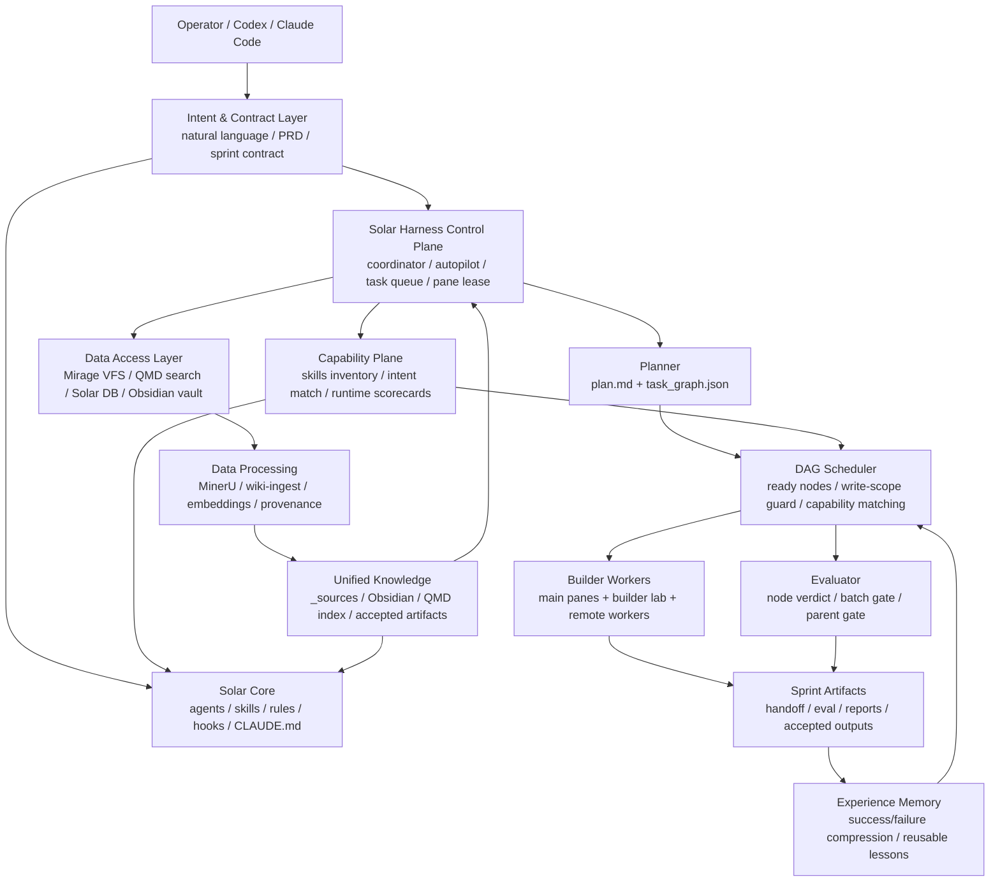
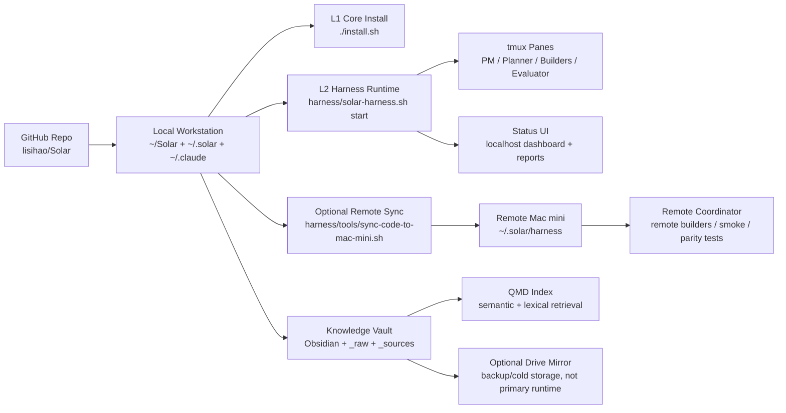
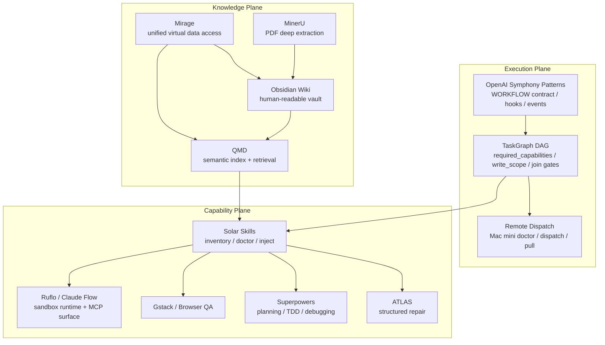

# Solar: AI Native Operating System

> Token In → Token Out | 从计算本质重构的智能操作系统

[](LICENSE)
[](docs/agents.md)
[](docs/skills.md)

## 当前范围：Solar = AI Native Core + Solar Harness + Unified Knowledge

**Solar** 现在是一个 AI-native operating system 原型，不只是 Claude/Codex 的提示词集合。它由三层组成：

- `core/`, `agents/`, `skills/`, `rules/`, `hooks/`: AI-native 工作流内核，提供 agent/persona、skill、规则、hook 和长期状态入口。
- `harness/`: Solar Harness 控制面，负责 sprint 合约、DAG 调度、pane lease、builder/evaluator 派发、远端执行、benchmark 和经验沉淀。
- `.solar/`, `codex-bridge/`, `scripts/`, `deploy/`, `docs/`: 部署契约、Codex 协同、导出、巡检、知识沉淀和产品化辅助工具。

运行态数据库、个人日志、密钥、WAL/SHM、pane 截图、本机私有轨迹和本地模型缓存不作为公开源码提交；安装器和 Harness 会在本机生成这些运行态资产。

## 技术架构



## 部署架构



## 模块集成架构



## 功能特性

| 能力 | 状态 | 说明 |
|------|------|------|
| AI-native Core | ok | `agents/skills/rules/hooks/core` 可安装到 `~/.claude`，作为 Claude/Codex 工作流内核 |
| Solar Harness | ok | sprint contract、coordinator、task queue、pane lease、builder/evaluator 派发 |
| DAG 并行调度 | ok | `task_graph.json` 支持依赖、write_scope 冲突保护、join gate、parent gate |
| 能力自动选择 | ok | 根据任务文本推导 `required_capabilities`，调度前自动 enrich，派发文本显式展示 |
| 多 pane 协同 | ok | 主屏 + builder lab，支持不同模型/worker 能力和 lease 保护 |
| 远端执行 | ok | `solar-remote-dispatch` 支持 doctor、dispatch、pull 和 Mac mini 复核链路 |
| 知识库闭环 | ok | Obsidian Wiki、QMD、Solar DB、accepted artifacts、wiki dispatch |
| 文档/PDF 处理 | ok | MinerU / MarkItDown / wiki-ingest / QMD index 分层处理 |
| 统一数据访问 | warn | Mirage VFS 设计和基础 mount 存在，深层 SDK/FUSE 闭环继续演进 |
| Ruflo / Claude Flow | ok | sandbox runtime 可用，CLI/MCP smoke 通过，不污染宿主项目 hooks |
| Benchmark / Proof | ok | capability certification、activation proof、fusion benchmark、heavy proof |
| 自演化能力 | ok | capability scorecard、runtime-aware ranking、experience memory 和 regression gates |

## 快速开始

```bash
git clone https://github.com/lisihao/Solar.git ~/Solar
cd ~/Solar
./install.sh
```

常用入口：

| 入口 | 命令/位置 | 用途 |
|------|-----------|------|
| L1 安装 | `./install.sh` | 安装 Solar Core 到 `~/.claude` / `~/.solar` |
| Agent 使用 | `@Coder`, `/commit`, `/review` | 通过 Claude/Codex 调用 agents 和 skills |
| Harness 控制面 | `harness/solar-harness.sh` | sprint 合约、派单、eval、coordinator |
| Harness 自检 | `cd harness && ./doctor.sh --summary` | 检查本地运行环境和控制面 |
| Coordinator | `cd harness && ./solar-harness.sh start` | 启动 tmux panes + coordinator |
| Status UI | `cd harness && ./solar-harness.sh status-server` | 打开本地状态面板、配置页和集成健康 |
| 远端同步 | `harness/tools/sync-code-to-mac-mini.sh` | 同步 MacBook/Mac mini Harness 代码 |
| 远端复核 | `solar-remote-dispatch doctor --json` | 检查 SSH、rsync、remote harness、tmux、pane 状态 |
| 能力证明 | `harness/solar-harness.sh integrations activation-proof --json` | 证明默认 dispatch/DAG/runtime/负例控制 |

## 部署方式

1. 本机安装：

   ```bash
   git clone https://github.com/lisihao/Solar.git ~/Solar
   cd ~/Solar
   ./install.sh
   ./scripts/smoke-install.sh
   ```

2. Harness 启动：

   ```bash
   cd ~/Solar/harness
   ./doctor.sh --summary
   ./solar-harness.sh start
   ./solar-harness.sh coord-status
   ```

3. 远端 Mac mini 镜像部署（可选）：

   ```bash
   cd ~/Solar/harness
   ./tools/sync-code-to-mac-mini.sh
   solar-remote-dispatch doctor --host <user@mac-mini-host> --json
   ```

4. 提交/发布前检查：

   ```bash
   cd ~/Solar
   ./scripts/smoke-install.sh
   cd harness
   bash -n coordinator.sh lib/pane-lease.sh
   python3 -m py_compile lib/graph_scheduler.py lib/graph_node_dispatcher.py lib/pane_lease.py
   ./solar-harness.sh integrations activation-proof --json
   ```

## ⚡ 一键安装（3 分钟）

> **真实可执行最小路径** — 只承诺 L1 基础安装，不假装存在的功能。

### 给人看：直接跑

```bash
git clone https://github.com/lisihao/Solar.git ~/Solar
cd ~/Solar && ./install.sh
```

安装完成后会自动 verify 6 项,全 ✅ 表示成功。

### 给 AI agent 看：复制整段粘贴给 Claude / Codex / Cursor / Copilot

> 请帮我安装 Solar:
>
> 1. 严格按 https://raw.githubusercontent.com/lisihao/Solar/main/INSTALL-AGENT.md 的 8 步执行
> 2. 每步必须先报告"目的+命令+预期输出",我点头才执行
> 3. 任一步失败立刻停下,告诉我失败的具体输出,不要静默跳过
> 4. 装完后必须跑 `cd ~/Solar && ./install.sh` 末尾的 6 项自检,全 ✅ 才算成功
> 5. 基础安装只要求 L1 自检通过；如果需要 L2 Harness，再进入 `~/Solar/harness` 运行 `./doctor.sh --summary`
>
> 现在开始 Step 1:系统检测。

### 安装做了什么

| 阶段 | 操作 | 产物 |
|------|------|------|
| 1. clone | 单仓库 `lisihao/Solar` 到 `~/Solar` | `~/Solar/` |
| 2. 备份 | 现有 `~/.claude/` (如有) | `~/.claude/backup-<时间戳>/` |
| 3. 复制 | `~/Solar/{CLAUDE.md, rules, skills, agents, hooks, core}` → `~/.claude/` | `~/.claude/` 内容 |
| 4. 初始化 | 创建 `~/.solar/` + `solar.db` (如有 schema) | `~/.solar/solar.db` |
| 5. 自检 | 6 项 verify 输出 PASS/FAIL | 退出码 0=成功 |

### 验收 (装完跑这一条)

```bash
ls ~/.claude/CLAUDE.md ~/.claude/rules ~/.claude/skills ~/.claude/agents ~/.solar && \
echo "✅ Solar L1 安装就位"
```

任一文件/目录不存在则失败,跳到 [INSTALL-AGENT.md Step 7 Troubleshoot](INSTALL-AGENT.md#step-7-troubleshoot)。

### 必需 vs 可选

- **必需** (L1 基础): `~/Solar` 仓库 + `./install.sh` → `~/.claude/` 配置就位 → 启动 Claude Code 输入 `solar` 看启动宣告
- **可选** (L2 高级): Solar Harness 协调器 / Sprint / DAG 调度 / 远端执行 — 位于 `~/Solar/harness`，先跑 `cd ~/Solar/harness && ./doctor.sh --summary`
- **可选** (L3 项目): `~/Solar-MAX` 项目模式 — 独立大仓库, 详见 USER-GUIDE

完整 8 步剧本: [INSTALL-AGENT.md](INSTALL-AGENT.md)

### 维护者: 改动后自测

修改 `install.sh` 或仓库结构后, 跑 fresh-install smoke (沙盒里独立验证, 不污染本机 `~/.claude/`):

```bash
./scripts/smoke-install.sh
```

输出 `✅ Solar L1 Smoke Test PASSED` 才能 push。

## 📖 使用说明

👉 **[完整用户使用指南 (USER-GUIDE.md)](./USER-GUIDE.md)** — 849 行全面文档

涵盖：
- 触发词大全（100+ 常用触发词）
- 核心命令速查（18 个 bin 命令）
- MCP 工具调用技巧
- Skills 速查（Top 50 分类）
- Sprint 工作流详解
- 知识库使用指南
- 故障排查 FAQ
- 进阶定制方法

快速参考：[TRIGGERS.md](./TRIGGERS.md) | [SPRINTS-HIGHLIGHTS.md](./SPRINTS-HIGHLIGHTS.md)

---

## Why AI Native?

**传统方案**: 在现有 OS 上叠加 AI 功能 (AI-Powered)
**Solar**: 从计算本质为 AI 重新设计 (AI-Native)

| 维度 | 传统 OS + AI | Solar (AI Native) |
|------|-------------|-------------------|
| 交互入口 | GUI/CLI | **语义意图** |
| AI 角色 | 附加特性 | **内核一等公民** |
| Token 效率 | 低（大量冗余） | **高（最短路径）** |
| 执行模式 | 多层翻译 | **结构化 Action** |
| 记忆系统 | 文件路径 | **语义索引** |

```
┌─────────────────────────────────────────────────────────────────┐
│                      AI Native OS 架构                          │
├─────────────────────────────────────────────────────────────────┤
│  Intent Layer      │ 自然语言 / @Agent / /Skill                │
│  ─────────────────────────────────────────────────────────────  │
│  Semantic Parser   │ sys_agents + sys_skills + 路由规则        │
│  ─────────────────────────────────────────────────────────────  │
│  Execution Engine  │ 13 Agents + 五阶段流程 + Gate 检查        │
│  ─────────────────────────────────────────────────────────────  │
│  Self-Evolution    │ 互评系统 + 书记员 + 自动优化              │
│  ─────────────────────────────────────────────────────────────  │
│  UI Runtime        │ TVS ZenWhite 设计系统                     │
└─────────────────────────────────────────────────────────────────┘
```

## Quick Start

| 说 | 启动模式 | 描述 |
|-----|----------|------|
| "我要开发" | Solar Dev | 13个Agent + 五阶段流程 |
| "我要办公" | Clawbot | 邮件/日程/文档/任务处理 |
| "我要研究" | Research | 技术调研 + 可行性分析 |

```bash
# 安装 (与首页"一键安装"一致)
git clone https://github.com/lisihao/Solar.git ~/Solar
cd ~/Solar && ./install.sh

# 使用
@Coder 优化这个函数    # 直达 Agent
/commit               # 调用 Skill
```

## What's New (2026-02)

### 🔥 抗失忆工作流 - STATE/DECISIONS 架构

传统 AI 会话的最大问题：上下文压缩导致失忆。Solar 通过文件系统持久化彻底解决：

```
第零原则: 对话是缓存，文件是唯一真相源

.solar/STATE.md      - 当前作战态势 (Mission/Constraints/Progress/Next Actions)
.solar/DECISIONS.md  - 决策日志 (追加式，永不压缩)
.solar/LOG/          - 命令历史、基准数据、错误记录
```

**效果**: 即使会话压缩，读取 STATE.md 即可恢复完整上下文。

### 🏃 冲刺节奏控制 - 20~60 分钟工作块

每个任务拆解为可检查点的冲刺块：
- **开场 30 秒**: 读 STATE.md，复述 Mission/Next Actions
- **执行 10-40 分钟**: 只做 Next Actions，不跑题不发散
- **收尾 2 分钟**: 更新 Progress + git checkpoint

### 🧬 Skin-Check v2.0 - 本地模型实现

AI 驱动的皮肤健康检测系统：
- **Phase 2.1**: CoreML + MobileNetV3 本地分类 (~30ms, 100x faster)
- **Phase 2.2**: YOLOv8 病灶检测 + 严重程度评估
- **Phase 2.3**: SQLite 历史追踪 + 30天趋势分析

性能：$0.002/次 → $0/次，3-5s → ~30ms

### 📊 Solar Web Dashboard

极简监控面板，实时展示系统状态和性能指标。

### 🚀 Token 优化 -42%

会话恢复从 16K tokens → 9K tokens，节省 42% 成本。

---

## Core Features

### Token First 原则

```
传统方式 (50+ tokens):
  用户: "检查磁盘"
  LLM: #!/bin/bash
       df -h | grep -E "^/dev" | awk '{print $1,$5}'
       # 检查使用率...

AI Native (8 tokens):
  用户: "检查磁盘"
  LLM: { "skill": "check_disk", "path": "/" }
```

**减少 85%+ Token 消耗**，同时提升安全性。

### 13 个专业 Agent

| 层级 | Agent | 职责 |
|------|-------|------|
| 决策 | Researcher / Architect / PM / Reporter | 调研、设计、验收、报告 |
| 执行 | Coder / Tester / Reviewer | 编码、测试、审查 |
| 支撑 | Docs / Ops / Guard / Secretary | 文档、部署、守护、记录 |
| 工具 | BenchmarkReporter / SkillMarket | 测试报告、技能市场 |

### 五阶段流程

```
P1 研究 → P2 设计 → P3 实现 → P4 验证 → P5 收尾
    │         │         │         │         │
    ▼         ▼         ▼         ▼         ▼
Researcher  Architect  Coder   Tester//   Ops→PM
  +Guard      +Guard           Reviewer   →Secretary
```

`//` = 并行 | `→` = 串行 | Gate 检查确保质量

### 自我演进系统

```
┌─────────────────────────────────────────────────────────────────┐
│                    Self-Evolution System                         │
├─────────────────────────────────────────────────────────────────┤
│  数据采集    │ Agent执行/Skill调用/阶段转换 → 自动记录          │
│  互评系统    │ 25条规则: Reviewer评Coder, PM评Tester...         │
│  书记员      │ 会议纪要 + 性能评估 + 优化建议                    │
│  持续优化    │ 基于历史数据自动调优参数                          │
└─────────────────────────────────────────────────────────────────┘
```

### 38 个 Skill

| 类别 | Skill |
|------|-------|
| 开发 | `/commit` `/pr` `/review` `/test` `/build` `/benchmark` |
| 文档 | `/docs` `/report` `/changelog` |
| 系统 | `/status` `/stats` `/save` `/restore` `/ontology` |
| 工具 | `/webapp-testing` `/mcp-builder` `/skill-creator` `/shortcut-builder` |
| 办公 | `/office` `/email-search` `/office-notes` `/office-tasks` `/office-reminders` |
| 健康 | `/skin-check` - AI 皮肤检测 (本地模型 + 专家评审) |

## Agent 宣告

每个 Agent 执行前必须输出宣告（Thinking Out Loud）:

```
┌─ 💻 Coder ──────────────────────────────────────┐
│ Task: 优化 Hash Join 性能                        │
│ Plan:                                           │
│   1. 分析当前瓶颈                                │
│   2. 实现 SIMD 加速                              │
│   3. 验证性能提升                                │
└─────────────────────────────────────────────────┘
```

## Session Recovery

```
┌─────────────────────────────────────────────────┐
│  传统方式: 恢复会话 10K-50K tokens              │
│  Solar:    /restore   ~500 tokens (节省 90%+)  │
└─────────────────────────────────────────────────┘
```

## Architecture

```
                    ┌─────────────────┐
                    │   User Intent   │
                    │  自然语言输入    │
                    └────────┬────────┘
                             │
              ┌──────────────┼──────────────┐
              │              │              │
              ▼              ▼              ▼
        ┌──────────┐  ┌──────────┐  ┌──────────┐
        │  Solar   │  │ Clawbot  │  │ Research │
        │ Dev Mode │  │  Office  │  │   Mode   │
        └────┬─────┘  └──────────┘  └──────────┘
             │
             ▼
┌─────────────────────────────────────────────────────────┐
│  Execution Engine                                        │
│  ┌─────┐ ┌─────┐ ┌─────┐ ┌─────┐ ┌─────┐               │
│  │ P1  │→│ P2  │→│ P3  │→│ P4  │→│ P5  │               │
│  │研究 │ │设计 │ │实现 │ │验证 │ │收尾 │               │
│  └─────┘ └─────┘ └─────┘ └─────┘ └─────┘               │
│     │       │       │       │       │                   │
│  Researcher Architect Coder  Tester  Ops               │
│            +Guard   +Guard  //Review  →PM              │
│                             //Docs    →Secretary       │
└─────────────────────────────────────────────────────────┘
             │
             ├──► ┌─────────────────────────────────────┐
             │    │  State Persistence (抗失忆)         │
             │    │  .solar/STATE.md + DECISIONS.md     │
             │    │  对话是缓存，文件是唯一真相源        │
             │    └─────────────────────────────────────┘
             ▼
┌─────────────────────────────────────────────────────────┐
│  Self-Evolution Layer                                    │
│  ┌──────────┐  ┌──────────┐  ┌──────────┐              │
│  │ sys_*    │  │ evo_*    │  │ 书记员   │              │
│  │ 191 表   │  │ 执行追踪 │  │ 汇总优化 │              │
│  └──────────┘  └──────────┘  └──────────┘              │
└─────────────────────────────────────────────────────────┘
             │
             ▼
┌─────────────────────────────────────────────────────────┐
│  TVS UI Runtime + Web Dashboard                         │
│  ZenWhite 设计系统 | 9种视觉风格 | 实时监控面板          │
└─────────────────────────────────────────────────────────┘
```

## Metadata System

191 张系统表支撑智能路由与自我演进:

| 类别 | 表 | 用途 |
|------|-----|------|
| 资源注册 | sys_agents, sys_skills, sys_hooks | 资源自省 |
| 路由规则 | sys_routing_model/agent/tool | 智能选择 |
| 执行追踪 | evo_agent_executions, evo_tool_calls | 数据采集 |
| 互评系统 | evo_review_rules, evo_votes | 质量评估 |
| 学习信号 | evo_learning_signals | 持续优化 |

## vs 业界方案

| 维度 | Solar | AutoGen | CrewAI | MetaGPT |
|------|-------|---------|--------|---------|
| AI Native 架构 | **Token First** | AI 叠加 | AI 叠加 | AI 叠加 |
| 五阶段流程 | **P1→P5 Gate** | 无 | 无 | 部分 |
| 自我演进 | **互评+书记员** | 无 | 无 | 无 |
| 会话恢复 | **90%+ Token 节省** | 无 | 无 | 无 |
| @Agent 直达 | **语义路由** | 无 | 无 | 无 |
| 多模式切换 | **Dev/Office/Research** | 单模式 | 单模式 | 单模式 |

## Documentation

- [AI Native OS Architecture](docs/AI_NATIVE_OS_ARCHITECTURE.md) - 架构设计原理
- [Workflow Design](docs/WORKFLOW_DESIGN.md) - 工作流程设计
- [Metadata System](core/nerve/README.md) - 元数据系统

## Installation

见首页 [⚡ 一键安装](#-一键安装3-分钟) — 唯一推荐路径。

**详细 8 步剧本** (供 AI agent 执行): [INSTALL-AGENT.md](INSTALL-AGENT.md)
**用户使用指南**: [USER-GUIDE.md](USER-GUIDE.md)
**OpenClaw / 小爱 AI 秘书集成** (高级): [DEPLOY.md](DEPLOY.md)

## License

MIT

---

**Solar** — AI Native Operating System | Token In → Token Out
