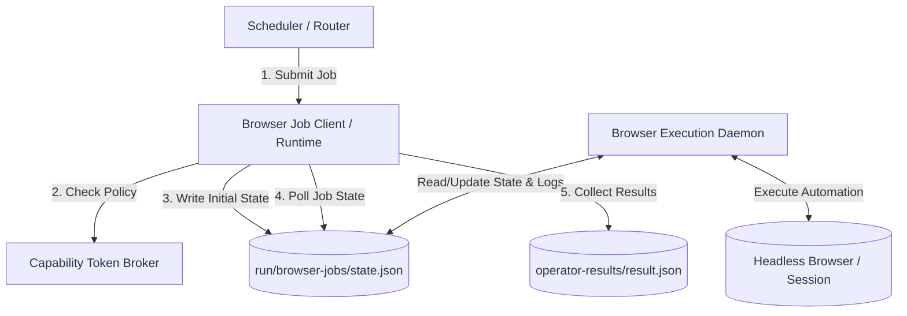
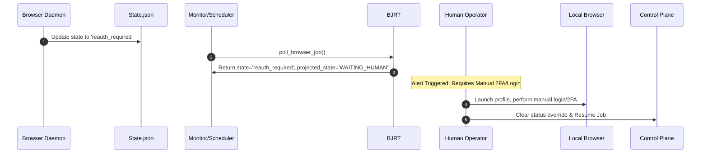

# Browser Agent Operator: Integration & Operations Playbook

This playbook documents the architecture, lifecycle, security boundaries, and operational procedures for the **Browser Agent Operator** within the `solar-harness` S6 Control Plane. 

---

## 1. System Architecture & Lifecycle

The Browser Agent Operator bridges the logical control plane (orchestrated by the scheduler and routers) and the physical browser execution plane. It isolates the scheduler from direct browser control (such as page clicks or DOM input events) by using an asynchronous job submit-poll-collect protocol.



### Job States Lifecycle
*   **`submitted`**: The job envelope is validated and written to disk.
*   **`running`**: The browser execution daemon has picked up the job and is executing.
*   **`reauth_required`**: Session auth expired or 2FA challenge triggered; projected state becomes **`WAITING_HUMAN`**.
*   **`done`**: Executed successfully. Artifacts (screenshots, logs) are ready for collection.
*   **`failed`**: Execution error occurred, or the job was cancelled by the controller.
*   **`timeout`**: Job exceeded its allocated runtime budget.

---

## 2. The Manual Re-login (`reauth_required`) Flow

When browser automation encounters a login gate, a CAPTCHA, or expired session cookies, it triggers a `reauth_required` state.



### Operator Action Protocol
1.  **State Projection**: When `poll_browser_job` reads a state of `reauth_required`, it projects the status as `WAITING_HUMAN`.
2.  **Notification**: The monitoring bridge generates a human-intervention ticket including the `profile_ref` and `account_label`.
3.  **Manual Login Procedure**:
    *   The administrator launches the corresponding Chrome profile on the target owner host (e.g. `lisihao@localhost`).
    *   Use the command:
        ```bash
        python3 -m browser_agent --profile "browser-agent" --interactive
        ```
    *   Navigate to the target website, complete the 2FA prompt or username/password challenge, and ensure the session is active.
4.  **Health Verification**: Verify session health without printing cookies:
    ```python
    from browser_job_runtime import BrowserSessionBroker
    broker = BrowserSessionBroker()
    status = broker.get_profile_health("browser-agent", "user@example.com")
    print(status["status"]) # Must output "healthy"
    ```
5.  **State Recovery**: Once verified, the operator clears the block status and the execution daemon resumes job execution automatically.

---

## 3. Evidence Ledger Layout & Secrets Sanitization

To ensure auditability, the Browser Agent runtime writes structured transaction files to the local file system.

### 3.1 Job State Ledger (`state.json`)
Location: `HARNESS_DIR/run/browser-jobs/{job_id}/state.json`
```json
{
  "job_id": "job-d250882e-9d2a-4df4-b333-e57a918a202d",
  "actor_id": "webapp_research_operator",
  "state": "running",
  "envelope": {
    "task_id": "T001",
    "sprint_id": "sprint-20260525-browser-agent-research-operators",
    "node_id": "N7",
    "profile_ref": "browser-agent",
    "account_label": "research-user",
    "objective": "Scrape public paper indices on arXiv"
  },
  "logs": "[2026-05-25T16:58:00Z] Job webapp_research_operator submitted.\n[2026-05-25T16:58:01Z] Transitioned to state: running\n",
  "artifacts": [],
  "created_at": "2026-05-25T16:58:00Z",
  "updated_at": "2026-05-25T16:58:01Z"
}
```

### 3.2 Collection Output Ledger (`result.json`)
Location: `HARNESS_DIR/run/operator-results/{operator_id}/{task_id}/result.json`
```json
{
  "task_id": "T001",
  "operator_id": "webapp_research_operator",
  "sprint_id": "sprint-20260525-browser-agent-research-operators",
  "node_id": "N7",
  "status": "completed",
  "exit_code": 0,
  "started_at": "2026-05-25T16:58:00Z",
  "finished_at": "2026-05-25T16:58:05Z",
  "log_tail": "[2026-05-25T16:58:00Z] Job webapp_research_operator submitted...\n[2026-05-25T16:58:05Z] Execution complete.",
  "artifacts": [
    "/Users/lisihao/.solar/harness/run/operator-results/webapp_research_operator/T001/screenshot.png",
    "/Users/lisihao/.solar/harness/run/operator-results/webapp_research_operator/T001/logs.txt"
  ]
}
```

### 3.3 Secrets Scrubbing & Sanitization
The runtime automatically sanitizes the logs, artifacts, and configuration envelopes before writing them to the ledger.

> [!WARNING]
> Under no circumstances should raw cookies, authorization headers, passwords, or API keys be logged.

*   **Explicitly Allowed Attributes**: Only `profile_ref` and `account_label` metadata are permitted in the raw envelope logs to match the current execution profile.
*   **Automatically Redacted Patterns**:
    *   `Set-Cookie` and `Cookie` headers are rewritten as `[SCRUBBED]`.
    *   `Authorization` headers and `Bearer` tokens are replaced with `Authorization: [SCRUBBED]`.
    *   API keys matching patterns like `sk-...` (OpenAI), `ghp_...` (GitHub), `github_pat_...`, AWS Access Keys, and password forms are sanitized using regular expressions during both serialization (`scrub_dict`) and file collection (`scrub_secrets`).

---

## 4. Production Enablement & Safety Policy

Before transitioning the Browser Agent Operator to production, the safety boundary must be strictly enforced.

### 4.1 Safety Policy Boundaries
1.  **Prohibited Payment Actions (Always Blocked)**:
    *   Any job objective containing keywords like `payment`, `checkout`, `buy`, `purchase`, `billing`, `subscribe`, `pay`, or `credit card` is immediately denied during the submission phase, raising a `PermissionError`.
2.  **Guarded Actions (Token Required)**:
    *   **Secrets / Credentials Form Filling**: Any action accessing private passwords/tokens is blocked unless the job has a valid `CapabilityToken` with `secrets.allowed: true` or `file_scope.secret_paths_allowed: true`.
    *   **Destructive Actions**: Objectives mentioning `delete`, `rm -rf`, `drop database`, `uninstall`, etc., are blocked unless the job has a valid `CapabilityToken` with `file_scope.destructive_allowed: true` or `shell_scope.destructive_commands_allowed: true`.

### 4.2 Allowed Domains & Network Policy
To prevent data exfiltration, the `CapabilityToken` restricts network requests:
*   Unrestricted network access is disabled (`network.unrestricted: false`).
*   The browser operator is only allowed to access whitelisted hosts defined under `network.allowed_hosts`. Typical targets include:
    *   `arxiv.org` (Scholarly papers)
    *   `github.com` (Code repositories)
    *   `pypi.org` (Package index)
    *   `huggingface.co` (Model repository)

---

## 5. Enablement Status Checklist

| Feature Component | Current Implementation Status | Validation Status | Real vs. Mock / Dry-Run |
| :--- | :--- | :--- | :--- |
| **Config Schema & Registry** | Complete (`physical-operators.json`, `logical-operators.json`) | Passed Schema Checks | **Real** — Schema and router configuration are fully live and operational. |
| **BrowserSessionBroker** | Complete (`BrowserSessionBroker`) | Passed Unit Tests | **Real** — Manages authentications, detects `reauth_required`, and projects `WAITING_HUMAN` state. |
| **Secrets Scrubbing Engine** | Complete (`scrub_secrets`, `scrub_dict`) | Passed Sanitization Tests | **Real** — Regex pattern matching actively redacts credentials. |
| **Safety Policies & Tokens** | Complete (`validate_browser_job_policy`) | Passed Exception Tests | **Real** — Rejects payment and unauthorized secrets/destructive commands. |
| **Browser Execution Daemon** | Simulated via state-transition sequences | Checked via `mock_sequence` | **Mock / Dry-Run** — The actual GUI/Browser control loop is stubbed out. Physical Chrome/Playwright drivers will bind to these files in the next sprint phase. |
