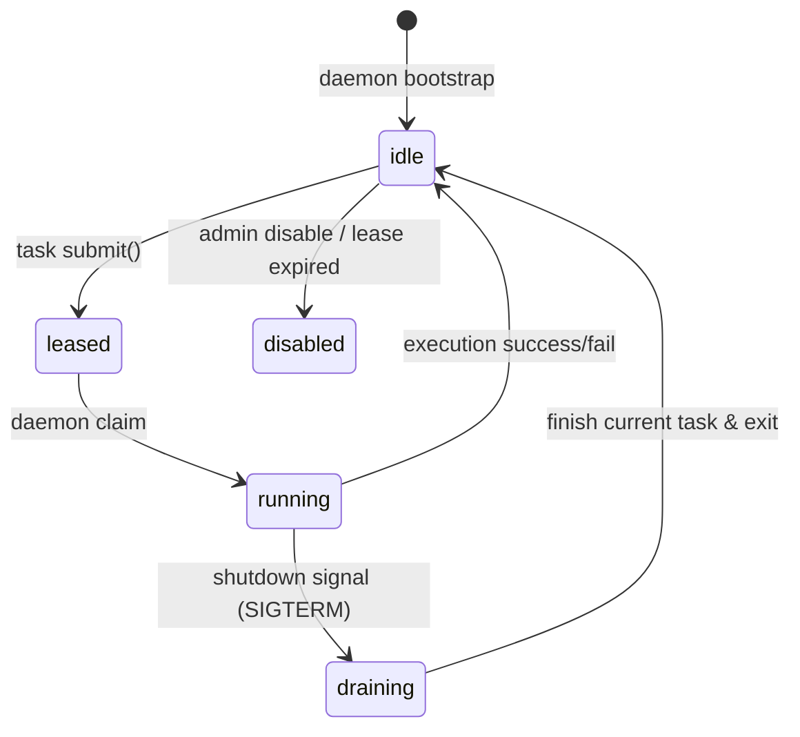

# Production Cutover Design: Persistent Operatord & Submit-Path Routing

## Knowledge Context
Knowledge Context: solar-harness context inject used.

## 1. Executive Summary
This design defines the production-ready implementation and cutover plan for transitioning Solar Harness multi-task dispatch from direct `tmux send-keys` command injection (legacy path) to a daemonized, process-locked `operator_runtime` submit-and-poll model. It systematically addresses the 5 core gaps (G1, G2, G3, G5, G8) identified in the previous foundation sprint acceptance report.

---

## 2. Persistent Daemon Lifecycle (Addressing G1)
Currently, `operatord run --operator <id>` performs only one-shot bootstrap configuration. In this design, we define a persistent daemon execution loop to handle tasks asynchronously and safely.

### 2.1 State Transitions
The operator daemon transitions through the following lifecycle states:
- `idle`: Daemon is active, healthy, and polling for tasks.
- `leased`: An incoming task has locked the operator via `submit()`.
- `running`: The daemon has claimed the task and is running the backend process.
- `draining`: The daemon is completing its active task before shutting down.
- `disabled`: The operator has been disabled administratively or via fallback.
- `quota_exhausted`: Dynamic state indicating API limit hits.
- `auth_expired`: Dynamic state indicating token/OAuth invalidation.

### 2.2 Daemon Loop & Heartbeat Details
1. **Bootstrap Phase**:
   - Parses the requested `operator_id`.
   - Resolves configuration via registry.
   - Sets the canonical tmux pane title for the operator's dedicated pane (e.g., `[Local] Builder | thunderomlx | idle`).
   - Ensures the inbox folder `run/operator-inbox/<operator_id>/` exists.
   - Cleans up any orphaned status records, initializing state to `idle`.
2. **Polling Loop**:
   - The daemon runs in a `while True` loop with a configurable interval (default: 1.0s).
   - In each tick, it checks `run/operator-inbox/<operator_id>/*.json` for task envelopes.
   - It also writes a heartbeat JSON file under `run/operator-status/<operator_id>.json` containing `operator_id`, `state`, `heartbeat_at`, `current_task_id` (if any), and `resolved_persona`.
3. **Task Acquisition & Claim**:
   - When a task envelope `T-xxx.json` is detected in the inbox:
     - The daemon atomically claims it by verifying the lease status (already set to `leased` by `submit()`).
     - It updates the lease state to `running` using `operator_runtime.update_operator_lease_state(operator_id, "running")`.
     - It updates its own heartbeat status file to state `running`.
4. **Execution & Secret-Scrubbed Logging**:
   - The daemon reads the configured `command` or standard command line for the operator class.
   - It launches the backend task process as a subprocess.
   - It captures `stdout` and `stderr` streams, writing them in real-time to:
     `run/operator-results/<operator_id>/<task_id>/output.log`
   - **Secret Scrubbing**: The output stream is piped through a scanning buffer that replaces known API keys, tokens, or pattern-matched credentials with `[SCRUBBED]`.
5. **Task Closeout & Result Contract**:
   - After the subprocess exits:
     - It records the exit code.
     - It checks if a required handoff file (e.g., `sprints/<sprint_id>.<node_id>-handoff.md`) exists.
     - It writes `run/operator-results/<operator_id>/<task_id>/result.json` containing:
       - `task_id`
       - `operator_id`
       - `sprint_id`
       - `node_id`
       - `status` (`completed` if exit_code == 0 and handoff exists; `failed` or `failed_missing_handoff` otherwise)
       - `exit_code`
       - `started_at` and `finished_at` (ISO 8601 UTC)
     - It removes the task envelope file from the inbox.
     - It releases the lease using `operator_runtime.release_operator_lease(operator_id)`.
     - It resets its dynamic status to `idle`.
6. **Graceful Shutdown**:
   - On receiving SIGINT/SIGTERM, the daemon transitions to `draining`. It allows any running subprocess to complete (up to a timeout), cleans up, and exits.

---

## 3. Inbox and Result Layout Contracts
To avoid race conditions and filesystem pollution, directory layouts are locked down:
- **Inbox Folder**: `run/operator-inbox/<operator_id>/`
  - Atomic submission: `submit()` writes a `.tmp` file and uses `os.replace` to name it `<task_id>.json`.
- **Result Folder**: `run/operator-results/<operator_id>/<task_id>/`
  - `result.json`: The machine-readable final status contract.
  - `output.log`: Scrubbed combined output log of the task execution.
  - `execution_summary.md` (optional): Brief markdown summarizing outcome metadata.

---

## 4. Timeout Semantics
1. **Submission Lease Expiry**:
   - Every submission acquires a lease with a TTL (default: 3600 seconds).
   - If the daemon has not completed the task before the lease `expires_at`, the scheduler registers a `timeout_failure`.
2. **Execution Timeout**:
   - The daemon monitors the elapsed time of its execution subprocess.
   - If the task exceeds the remaining lease TTL, the daemon terminates the subprocess (SIGTERM then SIGKILL), writes a failure code to `result.json`, and releases the lease.

---

## 5. Submit-Path Production Routing & Rollback (Addressing G5)
Currently, `multi_task_runner.py` directly executes tasks in newly spawned tmux windows using shell templates. We introduce a dual-path routing scheduler.

### 5.1 The `operatord_enabled` Feature Flag
A configuration flag `operatord_enabled: true | false` is added:
- At the global multi-task scheduler configuration level, or
- At the individual operator level in `config/physical-operators.json`.
By default, this flag will be `false` (legacy compatibility mode).

### 5.2 Direct vs. Submit Dispatch Paths
- **Legacy Path (Direct tmux pane injection)**:
  - If `operatord_enabled` is `false`, the runner spawns a tmux window and directly runs the builder/planner/evaluator CLI (e.g. `claude`, `agy`) inside that window.
- **Production Path (Submit routing)**:
  - If `operatord_enabled` is `true`, `multi_task_runner` routes through the daemon:
    1. Resolves the selected `operator_id` via capability matching.
    2. Builds a standard task envelope and calls `operator_runtime.submit()`.
    3. Spawns a lightweight tmux monitor window for user visibility.
    4. The monitor window runs a script that polls `${HARNESS_DIR}/run/operator-results/<operator_id>/<task_id>/result.json`.
    5. Once the result file appears, the monitor script reads the status/exit code, copies the handoff/results if successful, marks the node state in the graph (e.g., `completed` or `failed`), and exits.
    6. If the polling timeout is reached before the result file is written, it marks the task as failed (timeout).

### 5.3 Rollback Mechanism
- If `submit()` raises an exception (e.g., operator is leased, auth expired, or missing persona):
  - If `SOLAR_OPERATORD_ROLLBACK=1` is set in the environment:
    - The runner immediately falls back to the legacy direct dispatch path, logs a warning, and continues.
  - Otherwise:
    - The runner marks the node status as `failed` with the submission error details.

---

## 6. Preserving the No-Direct-Model DAG Rule
To ensure architectural decoupling:
- Task graph definitions (`task_graph.json`) MUST NOT contain concrete model names (e.g., `claude-3-5-sonnet`, `gemini-3.1-pro`).
- They must only declare task types (e.g., `ARCH_DESIGN`, `CODE_IMPL`), required capabilities (e.g., `planning >= 5`), or logical roles.
- `multi_task_runner` uses these metadata properties to filter the physical operator registry and dynamically select a valid operator instance. The selected `operator_id` is then used to call `submit()`.

---

## 7. Unified Persona Resolution (Addressing G2)
To resolve the discrepancy between submit-side validation and daemon-side loading:
1. **Consolidated Module**: Create a new module `lib/operator_persona.py`.
2. **Resolution Logic**:
   - Function `resolve_persona(config: dict) -> Path` reads the `persona` key from the operator's config.
   - If `persona` is empty/absent, it falls back to `role`.
   - It verifies that `personas/<persona>.md` exists, raising a structured error if missing.
   - If the resolved role is `evaluator`, it additionally validates and flags loading of `evaluator-verification-protocol.md`.
3. **Integration**:
   - Both `operator_runtime.submit()` and `tools/operatord.py` must import and use `lib/operator_persona.py`.
4. **Tests**:
   - Add unit tests verifying `persona != role` routing, role fallback compatibility, missing persona rejection, and evaluator verification protocol loading.

---

## 8. Observability: Pane Title and Bridge Status (Addressing G3, G8)
1. **Operator Pane Titles (G3)**:
   - For a running operator daemon, the title format must dynamically show lifecycle and lease details:
     `[<VendorLabel>] <RoleLabel> | <ModelLabel> | <LifecycleState> [Task ID / Sprint ID / Node ID]`
     Example: `[Antigravity] Planner | gemini-3.1-pro | running [T-001/sprint-abc/N1]`
   - For an idle operator: `[Antigravity] Planner | gemini-3.1-pro | idle`
2. **Bridge/Status Observability (G8)**:
   - `solar-harness multi-task status --no-clear --renderer plain` and the JSON state files written by `monitor_bridge.py` will read from `run/operator-status/*.json`.
   - It will surface:
     - `operator_id` and canonical vendor/provider details.
     - Resolved `persona_file` and whether the verification protocol was loaded.
     - Current lifecycle state, lease ID, lease expiration time, and last heartbeat.
