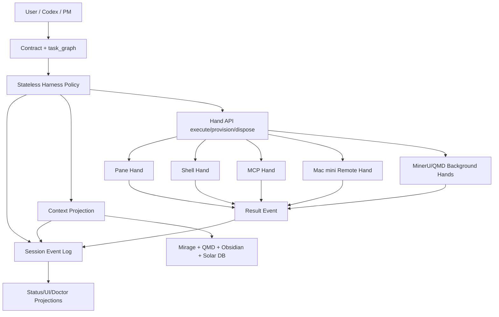

# Design: Managed Agent Runtime Interfaces

## One-Line Architecture

Solar-Harness keeps the existing tmux/coordinator product surface, but inserts a stable runtime interface layer underneath: session facts, harness policy, disposable hands, context projections, and worker leases.

## Stack

```text
┌──────────────────────────────────────────────────────────────┐
│ Product / Operator Surface                                   │
│ solar-harness CLI / status UI / two tmux screens / contracts │
├──────────────────────────────────────────────────────────────┤
│ Harness Policy Layer                                         │
│ wake / graph scheduler / autopilot / evaluator / model route │
├──────────────────────────────────────────────────────────────┤
│ Runtime Interface Layer                                      │
│ Session API / Hand API / Worker API / Context Projection API │
├──────────────────────────────────────────────────────────────┤
│ Execution Hands                                              │
│ pane / shell / MCP / remote Mac mini / MinerU / QMD / Mirage │
├──────────────────────────────────────────────────────────────┤
│ Durable Facts + Projections                                  │
│ session events / state.db / status cache / reports / vault   │
└──────────────────────────────────────────────────────────────┘
```

## Core Interfaces

### Session API

```python
get_events(session_id, cursor=None, start_seq=None, end_seq=None,
           event_type=None, activity_id=None, limit=None) -> EventPage
```

Purpose: let harness/context/evaluator inspect exact historical facts without stuffing the entire session into the model.

### Hand API

```python
provision(hand_type, resources, policy) -> HandRef
execute(hand_ref, command_name, input, idempotency_key) -> ResultEnvelope
dispose(hand_ref, reason) -> ResultEnvelope
```

Purpose: make pane, shell, remote worker, MCP, and future sandbox runtimes interchangeable.

### Worker API

```python
register(worker_id, capabilities, location, lease_policy)
heartbeat(worker_id)
acquire_lease(worker_id, session_id, activity_id)
release_lease(worker_id, activity_id, reason)
```

Purpose: make MacBook/Mac mini/lab panes behave like a worker pool, not hand-written route exceptions.

### Context Projection API

```python
build_context(session_id, policy, query=None, budget_tokens=None) -> ContextView
```

Purpose: model-visible context becomes a replayable projection with provenance: included event IDs, summarized ranges, dropped ranges, and KB hits.

## Migration Strategy

1. Adapter-first: add interface wrappers without replacing coordinator.
2. Safe hands first: `mock`, `shell` safe commands, `pane` dry/local, `remote` manifest-only.
3. Projection-first context: context view references session facts; it never mutates facts.
4. UI only reads health: do not make UI the runtime source of truth.
5. Chaos gate before default use: no adapter becomes default until it passes positive and negative controls.

## Risk Controls

- `shell` adapter must run denylisted/destructive-command checks.
- `pane` adapter must respect pane lease and no-dispatch flags.
- `remote` adapter must not claim success without manifest/checksum evidence.
- `context_projection` must redact known secret patterns.
- chaos suite must include negative controls, not only happy path.

## Mermaid


