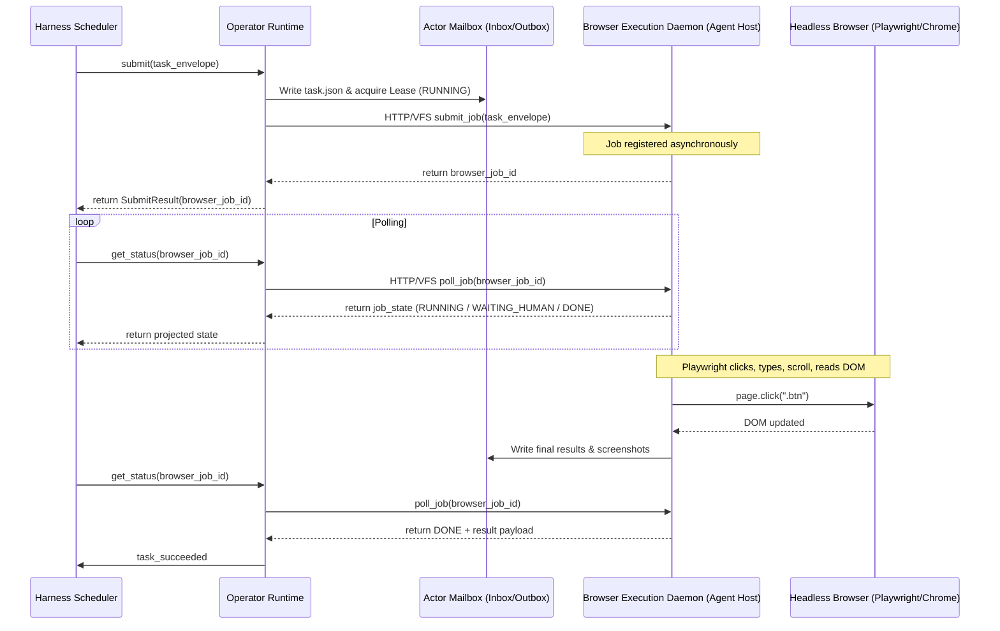
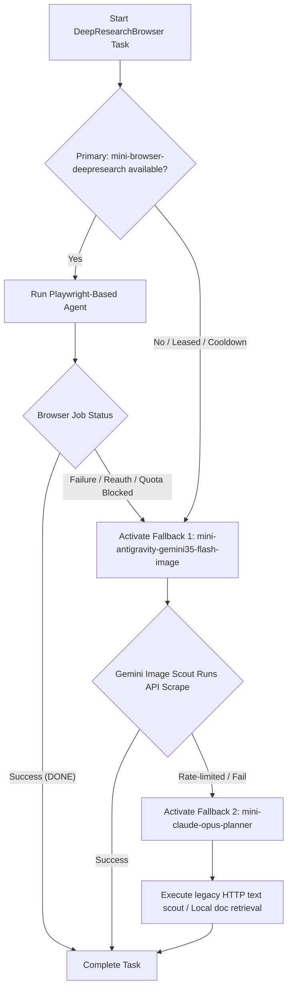

# Architecture & Design: Async Browser Agent Operators & ActorHost Runtime

This document outlines the system architecture, schemas, state machine, safety boundaries, and fallback routing for introducing Browser Agent Operators into the Solar Harness.

---

## 1. Concrete Files to Change

The implementation of Browser Agent Operators will modify the following configuration and code files:

### 1.1 Schemas & Configurations (Write Scope)
1. **[MODIFY] [agent-actors.schema.json](file:///Users/lisihao/Solar/harness/config/agent-actors.schema.json)**
   * Add `browser_use` and `gui_use` capabilities explicitly to baseline capabilities.
   * Expand `risk_profile` schema to support browser-specific restrictions (e.g., `allowed_domains`, `file_upload_policy`, `cookie_export_policy`).
2. **[MODIFY] [actor-hosts.schema.json](file:///Users/lisihao/Solar/harness/config/actor-hosts.schema.json)**
   * Add new `host_type` enums: `browser_profile_host` and `browser_agent_session`.
   * Add `browser_metadata` structure to `host_address` to specify profile directories, debug ports, proxy configurations, and sandbox settings.
3. **[MODIFY] [logical-operators.schema.json](file:///Users/lisihao/Solar/harness/config/logical-operators.schema.json)**
   * Add `DeepResearchBrowser`, `WebappResearchOperator`, and `InteractiveFormFiller` to the `logical_operator_type` enum definition.
4. **[MODIFY] [agent-actors.json](file:///Users/lisihao/Solar/harness/config/agent-actors.json)**
   * Define concrete browser-use actors (e.g., `mini-browser-deepresearch`, `mini-browser-builder`).
   * Bind them to the appropriate browser-agent host instances and specify their capabilities (e.g., `browser_use: 5`, `gui_use: 4`).
5. **[MODIFY] [actor-hosts.json](file:///Users/lisihao/Solar/harness/config/actor-hosts.json)**
   * Register host instances of type `browser_profile_host` with configuration parameters for headless Chromium profiles, isolated worktree bindings, and proxy targets.
6. **[MODIFY] [logical-operators.json](file:///Users/lisihao/Solar/harness/config/logical-operators.json)**
   * Bind `DeepResearchBrowser` and `WebappResearchOperator` to candidate browser-use actors.
   * Set up priority lists and selection/fallback policies.

### 1.2 Python Runtime & Core Logic (Write Scope)
7. **[MODIFY] [logical_operator_router.py](file:///Users/lisihao/Solar/harness/lib/logical_operator_router.py)**
   * Expand the `P0_LOGICAL_OPERATORS` set to include the new browser logical operator types.
8. **[MODIFY] [operator_runtime.py](file:///Users/lisihao/Solar/harness/lib/operator_runtime.py)**
   * Update state classification logic (`get_operator_runtime_state`) to support polling async browser jobs.
   * Update the `submit` protocol to handle async browser actor dispatches, producing a `browser_job_id` instead of locking a synchronous pane session.
   * Add browser-specific scrubbing rules to `scrub_secrets` (e.g., cookie values, storage state JSONs, basic auth).
9. **[MODIFY] [actor_lease.py](file:///Users/lisihao/Solar/harness/lib/actor_lease.py)**
   * Ensure the lease broker allows state transitions related to async jobs (e.g., yielding lease ownership when waiting for human interactive login, or transitioning to `HUMAN_REQUIRED`).
10. **[MODIFY] [actor_runtime.py](file:///Users/lisihao/Solar/harness/lib/actor_runtime.py)**
    * Integrate capability token verification for async browser operations.
11. **[NEW] [browser_job_runtime.py](file:///Users/lisihao/Solar/harness/lib/browser_job_runtime.py)**
    * Create a helper client to submit, poll, and cancel jobs executed by the remote browser daemon.
    * Provide a mock/dry-run adapter to simulate async state transitions for unit and integration testing without active Chrome processes.
12. **[NEW] [test_browser_agent_operator.py](file:///Users/lisihao/Solar/harness/tests/runtime/test_browser_agent_operator.py)**
    * Introduce focused unit tests to verify the async browser state machine, capability enforcement, and fallback ladders under mocked browser daemon states.

---

## 2. Decoupling the Browser Agent Runtime from Click/Type Automation

To prevent thread blocking, terminal coupling, and environment drift, the Solar Harness **completely separates** the control plane runtime from low-level browser automation mechanics.



### 2.1 The Browser Execution Daemon (Agent Host)
The actual click, type, drag-and-drop, and DOM extraction protocols are executed by an independent **Browser Execution Daemon** (e.g., using `browser-use`, `Playwright`, or custom MCP modules). 
* The Harness **never** imports Playwright or drives Chrome directly in its scheduling threads.
* Communication occurs entirely via an asynchronous API contract (HTTP JSON endpoints or inbox/outbox VFS files).

### 2.2 Control Plane Client API (`browser_job_runtime.py`)
The control plane utilizes a lightweight async client that implements three core actions:
1. `submit_browser_job(actor_id: str, envelope: dict) -> str`
   Writes the payload containing objective, start URL, and capability tokens to the daemon and returns a unique `browser_job_id`.
2. `poll_browser_job(job_id: str) -> dict`
   Retrieves state (running, completed, failed, human_action_required), logs, and screenshot artifacts.
3. `cancel_browser_job(job_id: str) -> bool`
   Instructs the daemon to kill the Chromium instance associated with the job ID and reclaim host memory.

---

## 3. ActorHost Schema & Configuration Updates

The ActorHost registry is extended to specify how browser execution sandboxes are structured.

### 3.1 Updated `ActorHost` Schema Definition (in `actor-hosts.schema.json`)
```json
{
  "host_type": {
    "type": "string",
    "enum": [
      "mac_mini",
      "remote_vm",
      "local_workstation",
      "cloud_container",
      "localhost",
      "browser_profile_host",
      "browser_agent_session"
    ]
  },
  "browser_metadata": {
    "type": "object",
    "properties": {
      "profile_dir": {
        "type": "string",
        "description": "Absolute path to the Chrome User Data Directory containing session cookies."
      },
      "chrome_flags": {
        "type": "array",
        "items": { "type": "string" },
        "description": "Chromium launch flags (e.g., --headless=new, --disable-gpu)."
      },
      "debugging_port": {
        "type": "integer",
        "description": "Port for Remote Debugging Connection."
      },
      "vnc_url": {
        "type": "string",
        "description": "Optional VNC link to visually monitor interactive sessions."
      },
      "proxy_server": {
        "type": "string",
        "description": "Optional proxy endpoint for routing traffic through approved domains."
      }
    },
    "required": ["profile_dir"]
  }
}
```

### 3.2 Concrete Configuration Example (in `actor-hosts.json`)
```json
{
  "hosts": {
    "browser_session_deepresearch": {
      "host_id": "browser_session_deepresearch",
      "host_type": "browser_profile_host",
      "display_name": "Isolated Deep Research Browser Profile",
      "lifecycle": {
        "state": "online",
        "shutdown_policy": "auto"
      },
      "address": {
        "harness_dir": "/Users/lisihao/.solar/harness"
      },
      "browser_metadata": {
        "profile_dir": "/Users/lisihao/.solar/harness/run/browser-profiles/deepresearch",
        "chrome_flags": [
          "--headless=new",
          "--no-sandbox",
          "--disable-extensions"
        ],
        "debugging_port": 9222,
        "vnc_url": "vnc://localhost:5900"
      },
      "heartbeat": {
        "interval_sec": 10,
        "timeout_sec": 30,
        "path": "actors/_host/browser_session_deepresearch/heartbeat.json"
      }
    }
  }
}
```

---

## 4. Async Job State Machine

To coordinate non-blocking polling, the Browser Agent job has a discrete state machine nested within the overall Actor Lease lifecycle.

### 4.1 Job States
* **`SUBMITTED`**: Job envelope dispatched to host daemon; pending browser spin-up.
* **`RUNNING`**: Active browser process browsing, scrolling, and reasoning.
* **`WAITING_HUMAN`**: Browser has hit a transient blocker requiring manual human feedback (e.g., captcha solving).
* **`REAUTH_REQUIRED`**: Task requires login or 2FA token generation.
* **`DONE`**: Task completed successfully; evidence and outputs available.
* **`FAILED`**: Task errored out terminally (e.g., navigation failure, crash).
* **`TIMEOUT`**: Task exceeded maximum allotted execution duration.

### 4.2 State Lifecycle & Transition Logic
```text
           [ SUBMITTED ]
                 │
                 ▼
             [ RUNNING ]
            /     │     \
           /      │      \
          ▼       ▼       ▼
 [WAITING_HUMAN]  │  [REAUTH_REQUIRED]
          \       │       /
           ▼      ▼      ▼
        [ DONE ]  [ FAILED ]  [ TIMEOUT ]
```

### 4.3 Integration with Actor Leases

When a browser job transitions to `WAITING_HUMAN` or `REAUTH_REQUIRED`, the underlying Actor Lease must reflect this state without expiring or letting other processes hijack the lease.

1. **`leased` / `running` → `HUMAN_REQUIRED`**:
   * The job runtime detects a login wall or CAPTCHA.
   * The scheduler transitions the actor lease state to `HUMAN_REQUIRED` (or `WAITING_HUMAN`).
   * The lease TTL is paused, or extended by a configurable human-override margin (e.g., 600 seconds).
2. **`HUMAN_REQUIRED` → `running`**:
   * The human interacts via VNC or inputs credentials in the designated UI frame, then clicks "Resume".
   * The job returns to `RUNNING`, and the actor lease transitions back to `RUNNING` lease state.

---

## 5. Safety Boundaries & Security Stop Conditions

Browser agents interact with open networks, creating exposure vectors. Strict boundaries are enforced at the schema and runtime levels.

### 5.1 Sandbox & Network Containment
* **Allowed Domains list**: Supported via the actor policy schema configuration. Non-matching HTTP requests are rejected at the daemon-level proxy.
  ```json
  "policy": {
    "allowed_domains": [
      "github.com",
      "arxiv.org",
      "europepmc.org",
      "openalex.org"
    ]
  }
  ```
* **Read-only Filesystem Scope**: The agent profile limits file writes to the temporary run folder (`run/browser-jobs/{job_id}/outputs/`). It is prohibited from writing directly to the workspace source files or config schemas.

### 5.2 Secret Scrubbing & Data Redaction
* **Zero Cookie Logging**: The browser daemon output streams are passed through a strict scrubbing filter. Any logs containing `Set-Cookie`, `Cookie:`, `Authorization: Bearer`, or oauth parameters are redacted.
* **Storage State Redaction**: When downloading browser evidence (such as Playwright state files), values under `cookies` and `origins[*].localStorage` are automatically scrubbed or replaced with dummy placeholders, leaving only structural domain layouts.
* **Prompt Redaction**: Inputs sent to the browser LLM controller containing credentials (such as tokens or API keys fetched from secret vaults) are replaced with `[SCRUBBED_API_KEY]` placeholders.

### 5.3 Prohibited Actions (Terminal Stop Conditions)
The following actions trigger an **immediate task abort** and transition the job state directly to `FAILED` with an alert:
1. Attempting to access local network addresses (e.g., `localhost`, `127.0.0.1`, local subnets, metadata endpoints like `169.254.169.254`).
2. Attempting to click payment portals, checkout triggers, or billing subscription workflows.
3. Running Javascript inside the browser page console that references credentials, keychain items, or local session values.

---

## 6. Fallback Ladder

A robust fallback hierarchy ensures that if the Browser Agent fails due to authentication requirements, rate limits, or quota issues, the task is automatically degraded to non-browser interfaces.

### 6.1 Schema Fallback Model (in `agent-actors.json`)
For a logical operator of type `DeepResearchBrowser`, the fallback chain is defined in the bindings:

```json
{
  "bindings": {
    "DeepResearchBrowser": {
      "operator_type": "DeepResearchBrowser",
      "candidates": [
        {
          "actor_id": "mini-browser-deepresearch",
          "priority": 1,
          "condition": "always"
        },
        {
          "actor_id": "mini-antigravity-gemini35-flash-image",
          "priority": 2,
          "condition": "quota_ok"
        },
        {
          "actor_id": "mini-claude-opus-planner",
          "priority": 3,
          "condition": "always"
        }
      ],
      "selection_policy": "priority_first",
      "fallback_policy": "queue"
    }
  }
}
```

### 6.2 Fallback Ladder Mechanics



1. **Step 1 (Preferred)**: Run interactive browser agent (`mini-browser-deepresearch`). Full visual navigation, DOM parsing, and interactive verification.
2. **Step 2 (Visual Scraper Fallback)**: If blocked by login walls or browser crashes, route task to `mini-antigravity-gemini35-flash-image`. This operator uses static snapshots and API-based calls instead of dynamic Chromium automation.
3. **Step 3 (Text-Only Fallback)**: If visual tools are exhausted, fall back to `mini-claude-opus-planner` running legacy HTTP scrapers, extracting Markdown raw text via rate-limited API routes (`openalex`, `arxiv`), avoiding GUI automation entirely.
