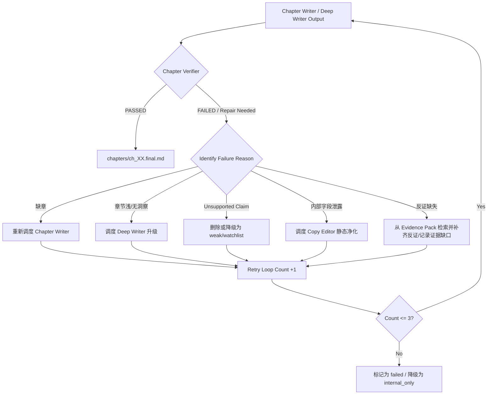

# Design — sprint-20260531-p0-ai-influence-youtube-报告流质量增强-report-ir-逐章写作-deep-w-s01-requirements

Knowledge Context: solar-harness context inject used

## 1. 定位

本切片仅交付 requirements 层的可验收拆解、追踪矩阵和下游交付契约，不直接修改 runtime、scripts、operator 或测试实现。

目标是把父 Epic 的 P0 YouTube 报告流质量增强诉求，收口成后续 S02（架构）、S03（核心运行时）、S04（调度与 UI）和 S05（验证与发布）可执行、可验证的结构化需求边界，重点解决“整份报告一次写完”导致的章节浅散漏、缺乏校验与自动修复的控制面缺失问题。

## 2. 输入与缺口

| 输入 | 状态 | 影响 |
| --- | --- | --- |
| `.prd.md` | ok | 已提供父需求、切片范围、验收标准和分阶段交付定义。 |
| `.contract.md` | ok | 已提供 priority (P0)、acceptance 与 stop rules。 |
| `.product-brief.md` | warn | 文件不存在；本设计基于 PRD/contract/parent epic 降级推进。 |
| `.requirement_ir.json` | warn | 文件不存在；本设计在 design/plan 中补充 requirement IDs。 |
| `.task_graph.json` | warn | 子任务 task_graph.json 不存在；本次已设计并创建可执行的 5 节点 DAG。 |
| 父 `.epic.md` | ok | 提供了整体背景、核心判断、硬性禁止及分阶段交付规约。 |
| 父 `.traceability.json` | ok | 已确认当前 child sprint (S01) 处于 active，后续 S02-S05 处于 queued。 |
| 父 `.task_graph.json` | ok | 已确认父级 Epic 的 5 节点粗粒度 child sprint 拓扑关系。 |

## 3. Requirement Groups

| ID | 需求组 | 核心验收焦点 | 目标切片 | 风险边界 |
| --- | --- | --- | --- | --- |
| **RG1** | **Report IR 契约化** | `report-ir.json` 包含 9 项全局元数据和章节 11 项属性，必须向下兼容旧 `report-plan.json` 并作为执行的唯一物理契约。 | S02 / S03 | 不得破坏旧版报告生成脚本的基础输入解析。 |
| **RG2** | **Chapter Jobs 状态机与类型系统** | 章节生命周期 7 态流转（queued -> writing -> deepening -> verifying -> repair_needed -> passed/failed）和 9 种 chapter_type 默认 deep writer 规则。 | S02 / S03 / S04 | 防止章节任务陷入死锁或状态挂起。 |
| **RG3** | **Chapter Evidence Pack 细化** | 每章 Evidence Pack 的 T0-T3 级别数据准入规则，核心趋势章节 min_videos>=2、min_transcript_segments>=4 及 counter_evidence 要求。 | S02 / S03 | 证据不足时必须降级为 weak/watchlist，防止强行编造结论。 |
| **RG4** | **Chapter Verifier 机制** | Chapter Verifier 至少覆盖 8 项静态/模型检查，生成包含 claim_text/confidence 等字段的 `claim-verification`，产生 passed/repair_needed/failed 决议。 | S02 / S03 / S05 | 保证 grounded_claim_ratio 默认目标 >= 0.90，拒绝幻觉 claims。 |
| **RG5** | **Repair Loop 控制流** | 缺章重写、弱章深化、unsupported claim 降级/删除、内部字段泄露净化、反证缺失自动修补的 5 大场景修复与退出（max 3 轮）机制。 | S02 / S03 / S05 | 失败后可转为 internal_only，但严禁强行发布。 |
| **RG6** | **Synthesizer 与 Copy Editor 策略** | 负责开头核心判断、章节过渡去重、语言风格统一及敏感/调度字段净化，严禁 Synthesizer 和 Copy Editor 新增或拔高任何事实。 | S02 / S03 | 避免 Synthesizer 在合成时出现二次幻想或信息泄露。 |
| **RG7** | **Quality Score 量化评分体系** | 基于 9 项加权评分公式落盘 `quality-score.json`，并划分 A/B/C/D 等级指导发布决策。 | S02 / S03 / S04 | 评分公式的各项权值之和必须严格为 1.0。 |
| **RG8** | **Browser Agent Operator 规范与 Proof 验证** | 明确定义 6 类 Operator 的 Thinking 级别与 UI/Deep Research proof 强校验规则，缺 proof 视为任务失败。 | S02 / S03 / S05 | 严禁使用普通 direct GPT 输出冒充 Deep Research proof。 |
| **RG9** | **TechnologyDiagramPainter 图文报告契约** | 以结构化 `figure-spec` 驱动 `TechnologyDiagramPainter` 生成架构图 / 流程图 / 技术堆栈图，最终报告必须产 `figure-manifest.json` 并在 Markdown/HTML 中嵌入图和 caption。 | S02 / S03 / S04 / S05 | 图必须 evidence-grounded；证据不足时允许 skip/warn，严禁生成装饰性假图。 |

## 4. Data Specification Contracts

### 4.1 Report IR Schema (`report-ir.json`)
S02 必须根据以下字段定义 JSON Schema：
- **全局属性**：
  - `report_id`: string (格式：`rep_YYYYMMDD_...`)
  - `report_title`: string
  - `report_type`: string
  - `date_range`: string
  - `global_thesis`: string
  - `target_audience`: string
  - `tone`: string
  - `chapters`: list[chapter_spec]
  - `quality_targets`: dict (包含 `grounded_claim_ratio` 等目标值)
- **章节属性 (`chapter_spec`)**：
  - `chapter_id`: string (格式：`ch_XX`)
  - `title`: string
  - `chapter_type`: string ( executive_summary | core_trend | technical_deep_dive | big_name_viewpoints | project_implications | video_digest | watchlist | noise_and_risk | appendix )
  - `priority`: string ( P0 | P1 | P2 )
  - `deep_writer_required`: boolean ( executive_summary, core_trend, technical_deep_dive, big_name_viewpoints, project_implications, noise_and_risk 默认为 true )
  - `expected_words`: integer
  - `required_questions`: list[string]
  - `required_evidence`: list[string]
  - `selected_video_refs`: list[string]
  - `evidence_pack_id`: string
  - `status`: string ( queued | writing | deepening | verifying | repair_needed | passed | failed )

### 4.2 Chapter Evidence Pack
S02 必须定义的章节证据包结构：
- `selected_videos`: list[string]
- `transcript_segments`: list[dict] (含 `video_id`, `timestamp_start`, `timestamp_end`, `text`, `source_quality`)
- `semantic_packets`: list[dict]
- `cross_source_links`: list[dict]
- `counter_evidence`: list[dict]
- `must_use_evidence_ids`: list[string]
- `optional_evidence_ids`: list[string]
- **准入分级规则**：
  - `T0/T1`: transcript 视频可用作核心判断的核心支撑证据。
  - `T2`: 仅能作为辅助支持证据 (`support_only`)。
  - `T3/failed`: 只能用于元数据引用 (`metadata_only`)，不得用于任何事实和趋势的直接判定。

### 4.3 Quality Score 评分公式与发布判定
S02 需严格按照以下加权公式实现质量评分系统（`validation/quality-score.json`）：
$$QualityScore = 0.20 \times G + 0.15 \times C + 0.15 \times D + 0.15 \times X + 0.10 \times A_{tech} + 0.10 \times A_{act} + 0.05 \times E_{counter} + 0.05 \times R_{read} + 0.05 \times S_{completeness}$$
其中：
- $G$: `evidence_grounding_score` (基于 grounded_claim_ratio)
- $C$: `thesis_clarity_score` (核心结论明确度)
- $D$: `insight_density_score` (洞察信息密度)
- $X$: `cross_source_score` (跨视频源交叉印证度)
- $A_{tech}$: `technical_accuracy_score` (技术术语和事实准确度)
- $A_{act}$: `actionability_score` (对项目的可落地指导性)
- $E_{counter}$: `counterargument_score` (反证/风险挑战章节的客观度)
- $R_{read}$: `readability_score` (可读性与无字段泄露)
- $S_{completeness}$: `structure_completeness_score` (结构完整性)

**评级决策树**：
- $Score \ge 85$: **A级** (可安全发布，`publishable`)
- $75 \le Score < 85$: **B级** (可发布但需带有事实不确定性警告或证据注脚，`publishable_with_notes`)
- $60 \le Score < 75$: **C级** (内部审阅参考，严禁对外发布，`internal_only`)
- $Score < 60$: **D级** (进入 repair 流程，修补失败则直接 blocked，`blocked`)

### 4.4 Figure Bundle Contract (`figures/*.json`, `figure-manifest.json`)
S02 必须定义图生成与嵌入契约，供 YouTube 报告 runtime 调用 `TechnologyDiagramPainter`：
- `figure-spec.json`:
  - `figure_id`: string (格式：`fig_XX`)
  - `figure_type`: string (`architecture_overview` | `trend_flow` | `technology_stack`)
  - `placement`: string (`report_lead` | `chapter_inline` | `appendix`)
  - `title`: string
  - `caption`: string
  - `source_chapter_ids`: list[string]
  - `evidence_refs`: list[string]
  - `input_outline`: list[string]
  - `render_prompt`: string
  - `status`: string (`queued` | `painted` | `skipped` | `failed`)
- `figure-result.json`:
  - `figure_id`, `status`, `image_path`, `request_dir`, `chatgpt_url`, `browser_session_id`, `original_image_ok`, `error`
- `figure-manifest.json`:
  - `report_id`, `figures`, `painted_count`, `skipped_count`, `failed_count`, `validator_overall`

图生成规则：
- 每份报告默认目标 1-3 张图，不允许无限制生图。
- `architecture_overview` 用于总结核心技术路线或系统结构。
- `trend_flow` 用于表达趋势演进、因果链或执行流程。
- `technology_stack` 用于表达生态分层、模型/数据/工具栈关系。
- 每张图必须绑定 `source_chapter_ids + evidence_refs`，不得脱离正文和证据独立臆造。
- 若 `evidence_refs` 不足、章节未通过 verifier、或 Deep Writer proof 缺失，对应图必须 `skipped/warn`，不得继续生成。

## 5. Verifier & Repair Loop Flow

### 5.1 Chapter Verifier 检查项
Chapter Verifier 需检查以下 8 项标准，并输出 `chapters/ch_XX.verification.json`：
1. `has_clear_thesis`: 包含本章的核心结论判断。
2. `uses_required_evidence`: 核心趋势判断严格使用 Evidence Pack 中的 evidence_id 或 video_ref。
3. `grounded_claim_ratio`: $GroundedClaims / TotalClaims \ge 0.90$。
4. `has_counter_evidence`: 对具有争议的趋势必须引用 counter_evidence。
5. `has_actionable_insight`: 提供可落地洞察，而非单纯内容复述。
6. `no_internal_field_leak`: 不包含 raw video_id、json key、harness 内部调度名称和 token 等内部敏感字段。
7. `no_unsupported_claim`: 杜绝任何虚假幻想或证据不足的论断。
8. `not_video_by_video_summary`: 严禁按照单个视频进行流水账式的总结。

### 5.2 Repair Loop 逻辑流

### 5.3 Figure Grounding Gate
`TechnologyDiagramPainter` 不是装饰性后处理，而是 verifier 之后的受控图生成阶段：
1. `Synthesizer` 产出结构化章节结果后，`Figure Spec Builder` 从 `report-ir + chapter_outputs + evidence_map` 编译候选图。
2. 仅 `passed` 章节可进入 `figure-spec` 编译。
3. `TechnologyDiagramPainter` 只吃 `figure-spec`，不直接吃整份自由文本报告。
4. `Figure Validator` 必须检查：
   - `has_evidence_refs`
   - `source_chapters_passed`
   - `image_exists`
   - `caption_not_empty`
   - `no_internal_field_leak`
5. `Figure Validator` 失败时：
   - 可单图降级为 `skipped`
   - 不应伪装为“已有图”
   - 不得把无图报告渲染成“图文并茂已完成”

## 6. Traceability Matrix

| 父级 Epic 缺口描述 | S01 Requirements 定义 | 下游承接切片与验证目标 |
| --- | --- | --- |
| 报告以整篇为单位写作，Planner 规划粒度受压扁，章节浮于表面 | **RG1, RG2**: 细化为 `report-ir.json`，将大报告分解为逐章执行的 chapter_jobs 并按优先级派发。 | **S03 Core Runtime**: 落实逐章状态机与 `tech_hotspot_radar.py` 循环调度。 **S05 Verification**: 验证 ch_XX.draft.md 和 ch_XX.deep.md 分步生成。 |
| P0/P1 核心深度章节缺乏深度，普通 GPT 输出冒充 Deep Research | **RG8**: 强制 P0/P1 章节绑定 `deep_writer_required=true` 必须经过 DeepWriterOperator 产出 `deep-research-state` proof。 | **S03 Core Runtime**: 在 Deep Writer 调度层验证 Proof 校验。 **S05 Verification**: 用缺乏 proof 的节点进行负控测试，验证必须失败被拦截。 |
| 对视频 transcript 中事实结论无交叉验证，存在幻觉下结论 | **RG3, RG4**: 细化 Evidence Pack，引入 T0-T3 视频分级准入。Chapter Verifier 计算 grounded_claim_ratio 需 $\ge 0.90$。 | **S03 Core Runtime**: 编写 Verifier 数据采集与 claim 验证模块。 **S05 Verification**: 验证使用 T3 transcript 或不实 claims 会触发 repair。 |
| 缺章或验证失败时整份报告直接 blocked，无法容错和自动修补 | **RG5**: 制定 Repair Loop 流程，限制最多 3 轮的 5 大场景定向修补。 | **S03 Core Runtime**: 实现修补状态流转与重试调度。 **S05 Verification**: 验证缺章能够自动触发重写并最终通过。 |
| 最终输出泄露 video_id、json key 等内部敏感信息 | **RG6**: 定义 Synthesizer 和 Copy Editor 的事实净化约束和信息密度合并约束。 | **S03 Core Runtime**: 编写 Copy Editor 净化正则与模型 prompt 拦截规则。 **S05 Verification**: 验证生成产物中没有 harness 及 raw video 敏感元数据。 |
| 缺乏可对报告产物客观衡量的多维度质量评分指标 | **RG7**: 定义包含 9 项加权评分公式的 `report_quality_score` 决策层。 | **S04 Orchestration/UI**: UI 面集成 quality-score.json 状态。 **S05 Verification**: 生成最终 A/B/C/D 分数报告。 |
| YouTube 洞察报告缺少结构图、流程图、技术栈图，图和文脱节 | **RG9**: 定义 `figure-spec -> TechnologyDiagramPainter -> figure-manifest` 契约，并要求最终 `report.md/report.html` 嵌入图、caption 和 evidence 绑定。 | **S03 Core Runtime**: 增加 Figure Spec Builder、Painter dispatch、Figure Validator、render/embed。 **S05 Verification**: 验证至少 1 张 evidence-grounded 图能落盘，缺证据时显式 skip/warn。 |

## 7. 下游边界

- **S02 Architecture**:
  - **必须消费**：S01 设计的 Report IR 结构、Chapter Jobs 状态流转条件、Evidence Pack 分级规则、Quality Score 公式及 Operator Proof 校验约束。
  - **严禁**：越过规范设计直接开始编写代码，或省略 Deep Writer 证明文件强校验逻辑。
- **S03 Core Runtime**:
  - **必须消费**：S02 设计的架构、接口与 schema 规范。
  - **严禁**：保留旧版“整篇报告一次性生成”作为默认执行方式。
  - **必须新增**：`figure-spec` 编译、`TechnologyDiagramPainter` 调度、`figure-manifest.json` 与最终 markdown/html 内嵌图能力。
- **S04 Orchestration / UI**:
  - **必须消费**：S01 和 S02 输出的质量评分、校验文件及任务运行状态数据。
  - **严禁**：只渲染文本总结，忽视对 quality-score.json 细项和 chapter validation 状态的可视化。
  - **必须新增**：figure pane/status，显示 `painted/skipped/failed`、image path、caption、source chapters。
- **S05 Verification / Release**:
  - **必须消费**：S01 定义的 Traceability Map、验收指标和负控测试点。
  - **严禁**：在没有 TDD 回归测试套件和 activation-proof 的情况下标记 Epic 完成。

## 8. Stop Rules

1. 缺失 `sprint-20260531-p0-ai-influence-youtube-报告流质量增强-report-ir-逐章写作-deep-w-s01-requirements.task_graph.json` 或 validation 失败，不得开始后续 S02-S05。
2. 缺乏 Machine-readable 的 `report-ir.json` 数据 Schema 定义，不得开始 S03 代码编写。
3. 章节 Evidence Grounding Ratio 低于 0.90 且没有进行 Repair 尝试的，不得标记为 passed。
4. P0/P1 章节没有提取到合规的 Deep Research proof 凭证，必须将其标记为 failed 阻断发布。
5. 最终生成的报告 markdown 文本中，若包含任何 video_id、json key 等 harness 敏感词汇，必须被 Copy Editor 拦截。
6. 不得使用 T3/failed 的 transcript 段落支持任何 P0/P1/P2 章节的核心趋势判断。
7. `TechnologyDiagramPainter` 生成的图若没有 `evidence_refs` 或 `figure-manifest.json` 缺字段，不得嵌入最终报告。
8. 缺证据或 validator 未过时，必须 `skipped/warn`，不得用装饰图补位。

## 9. Handoff

子 S01 需求拆解与追踪矩阵已在 requirements 层全面锁定。所有 9 个核心需求组（RG1-RG9）已完全映射到 S02-S05 下游阶段。后续 S02 架构阶段必须在 design.md 中严格遵照本规约进行数据模型、图生成契约与状态机接口的设计。
